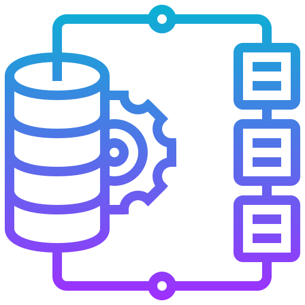
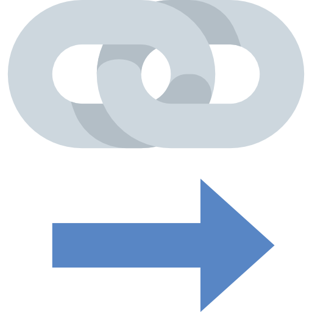
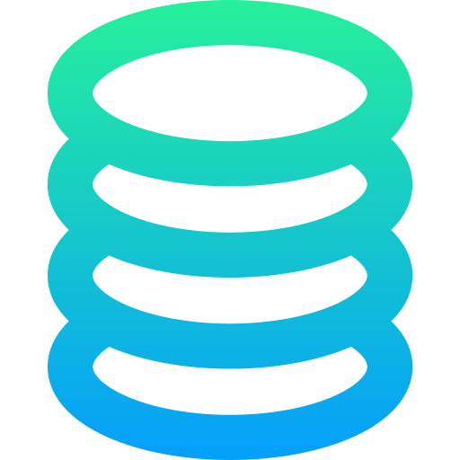
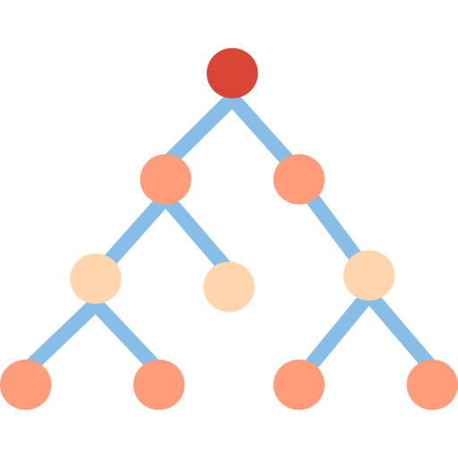
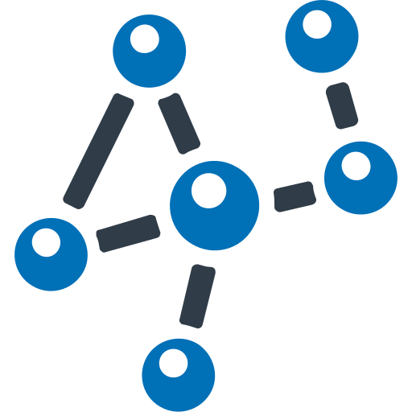

# DATA STRUCTURES

The objetive of this project is bild various data strutures types, learning on their behaivor and how to apply them.

# Assignments 

The following are assingments where I applied data strutres

 Tower of hanoi 

<!-- ## Tower of hanoi -->
 On this assingment was applied the data struture stacks  

Delayed Submission Note: the date of the last comment was made one day after the date of submission, this was done to correct the way to implement it. I did it manually and it was modified so that it has the algorithm to reach the result by itself.

- assignment link: https://github.com/Carlos0smar/Data-Structures/tree/main/src/main/java/cova/assignments/towersofhanoi

- assignment source: Data-Structures\src\main\java\cova\assignments\towersofhanoi

 Bubble sort 

<!-- ## Bubble sort -->
 On this assingment was applied the bubble sorting algorithm  

- assignment link: https://github.com/Carlos0smar/Data-Structures/tree/main/src/main/java/cova/assignments/bubblesort

- assignment source: Data-Structures/tree/main/src/main/java/cova/assignments/bubblesort

# Incremental Project

This project is a collection of data structures.  
You can run the project by running the main method in the `Main` class.
- Link: https://github.com/Carlos0smar/Data-Structures/blob/main/src/main/java/cova/datastructures/Main.java
  
- Route: Data-Structures/blob/main/src/main/java/cova/datastructures/Main.java

 Linked List 

<!-- ## Linked List -->

This data structure is a collection of nodes, where each node has a reference to the next node in the list. The first node is called the head and the last node is called the tail. The tail node has a reference to null.

Linked list and doubly linked list implementation:

- Link: https://github.com/Carlos0smar/Data-Structures/tree/main/src/main/java/cova/datastructures/linkedlists
  
- Route: Data-Structures/tree/main/src/main/java/cova/datastructures/linkedlists

Test cases for linked list and doubly linked list:

- Link: https://github.com/Carlos0smar/Data-Structures/tree/main/src/test/java/linkedliststests
- Route: Data-Structures/tree/main/src/test/java/linkedliststests

 Stack 

<!-- ## Stack -->

This data structure is a collection of elements, with two main principal operations: push, which adds an element to the collection, and pop, which removes the most recently added element that was not yet removed.

Stack implementation:

- Link: https://github.com/Carlos0smar/Data-Structures/tree/main/src/main/java/cova/datastructures/stacks
- Route: Data-Structures/tree/main/src/main/java/cova/datastructures/stacks

Test cases for stack:

- Link: https://github.com/Carlos0smar/Data-Structures/tree/main/src/test/java/stackstests
- Route: Data-Structures/tree/main/src/test/java/stackstests

 Queues 

<!-- ## Queue -->

This data structure is a collection of elements which follows FIFO method , with two main principal operations: enqueue, which adds an element to the collection, and dequeue, which removes the first added element that was not yet removed.

Queue and Dequeue with doubly linked list implementation:

- Link: https://github.com/Carlos0smar/Data-Structures/tree/main/src/main/java/cova/datastructures/queues
- Route: Data-Structures/tree/main/src/main/java/cova/datastructures/queues

Test cases for queue and dequeue:

- Link: https://github.com/Carlos0smar/Data-Structures/tree/main/src/test/java/queuestests
- Route: Data-Structures/tree/main/src/test/java/queuestests

 Binary Search Tree 

<!-- ## Binary Search Tree -->

This data structure is a collection of nodes, where each node has a reference to the left and right child. The left child is less than the parent node and the right child is greater than the parent node.

Binary Search Tree implementation:

- Link: https://github.com/Carlos0smar/Data-Structures/tree/main/src/test/java/treetests
- Route: Data-Structures/tree/main/src/test/java/treetests

Test cases for binary search tree:

- Link: https://github.com/Carlos0smar/Data-Structures/tree/main/src/test/java/treetests
- Route: Data-Structures/tree/main/src/test/java/treetests

 Graph 

<!-- ## Graph -->

This data structure is a collection of nodes, where each node has a reference to the other nodes in the graph. The graph can be directed or undirected.

Graph implementation:

- Link: https://github.com/Carlos0smar/Data-Structures/tree/main/src/main/java/cova/datastructures/Graphs
- Route: Data-Structures/tree/main/src/main/java/cova/datastructures/Graphs

Test cases for graph:

- Link: https://github.com/Carlos0smar/Data-Structures/tree/main/src/test/java/graphtests
- Route: Data-Structures/tree/main/src/test/java/graphtests

 Sorting Algorithms 

<!-- ## Sorting Algorithms -->

### Merge Sort

This algorithm is a divide and conquer algorithm that was invented by John von Neumann in 1945. It is a comparison-based algorithm that divides the input array into two halves, calls itself for the two halves, and then merges the two sorted halves.

- Link: https://github.com/Carlos0smar/Data-Structures/tree/main/src/main/java/cova/datastructures/mergesort
- Route: Data-Structures/tree/main/src/main/java/cova/datastructures/mergesort
- Test cases: https://github.com/Carlos0smar/Data-Structures/blob/main/src/test/java/sortingtests/MergeSortTests.java

### Quick Sort

This algorithm is a divide and conquer algorithm that was invented by Tony Hoare in 1959. It is a comparison-based algorithm that divides the input array into two halves, calls itself for the two halves, and then merges the two sorted halves.

- Link: https://github.com/Carlos0smar/Data-Structures/tree/main/src/main/java/cova/datastructures/quicksort
- Route: Data-Structures/tree/main/src/main/java/cova/datastructures/quicksort
- Test cases:https://github.com/Carlos0smar/Data-Structures/blob/main/src/test/java/sortingtests/QuickSortTests.java

### Bubble Sort

This algorithm is a comparison-based algorithm that compares each pair of adjacent items and swaps them if they are in the wrong order.

- Link: https://github.com/Carlos0smar/Data-Structures/tree/main/src/main/java/cova/datastructures/bubblesort
- Route: Data-Structures/tree/main/src/main/java/cova/datastructures/bubblesort
- Test cases:https://github.com/Carlos0smar/Data-Structures/blob/main/src/test/java/sortingtests/BubbleSortTests.java

